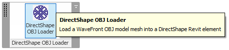
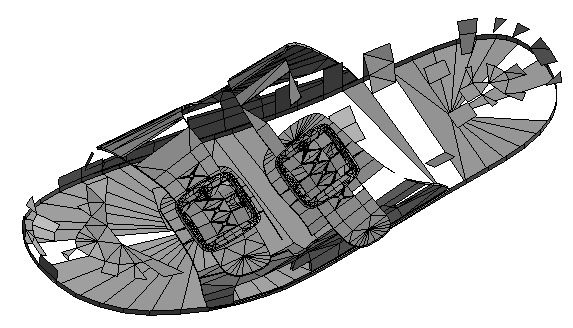
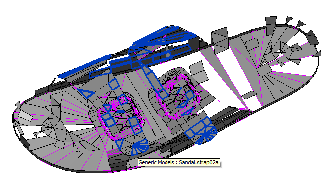
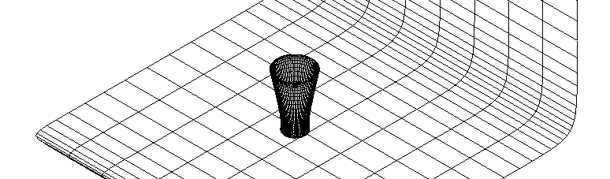

DirectObjLoader
===============

Revit add-in to load a WaveFront OBJ model and generate a DirectShape element from it.

The Building Coder provides a dedicated topic gropup where you
can [read all there is to know about the DirectShape Element](http://thebuildingcoder.typepad.com/blog/about-the-author.html#5.50).

The initial implementation and development history is documented in the article
[From Hack to App - OBJ Mesh Import to DirectShape](http://thebuildingcoder.typepad.com/blog/2015/02/from-hack-to-app-obj-mesh-import-to-directshape.html).

Sample fire hydrant OBJ file:

Resulting DirectShape element in Revit model:

Input scaling factor 1 versus 0.5 happily produces a gargoyle and a half:

OBJ files defining groups generate a separate DirectShape element for each one:

After adding support for faces with more than four vertices, the sandal.obj test file is loaded successfully, albeit with some missing faces:

Switched from TessellatedShapeBuilder target Mesh to AnyGeometry generated more internal model structure from the sandal.obj test file, still with some missing faces:

Release 2015.0.0.17 improved error handling on degenerate faces:

Wish List
---------

- Progress bar
- Support for materials, minimally colour, preferably textures
- Support for the options provided by the [StlImport](https://github.com/jeremytammik/StlImport) StlImportProperties class

Author
------

Jeremy Tammik, [The Building Coder](http://thebuildingcoder.typepad.com), Autodesk Inc.

Dependencies
------------

DirectObjLoader uses the
[FileFormatWavefront](http://nugetmusthaves.com/Package/FileFormatWavefront) NuGet package based on Dave Kerr's
[file-format-wavefront](https://github.com/dwmkerr/file-format-wavefront) GitHub library.

License
-------

This sample is licensed under the terms of the [MIT License](http://opensource.org/licenses/MIT). Please see the [LICENSE](LICENSE) file for full details.
